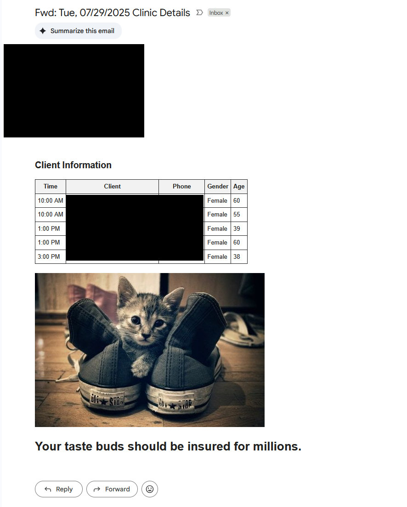

# Appointment Reminder System

This project is an automated clinic reminder system that I built for my girlfriend. She works with clients seeking immigration assistance and meets with multiple clients a week. She previously had to manually log into her scheduling portal each evening to gather the next day's client information, which was time-consuming and stressful. I built this tool for her so that she could spend less time worrying about the clinic the next day.

## Features:
- Selenium-based web scraping
- Automated email notifications
- Runs on Raspberry Pi via cron
- STDOUT and STDERR is redirected to a text file for logging and debugging purposes

## Overview:

1. The script starts with loading environmental variables that contain sensitive information such as login emails and passwords. Environmental variables were utilized, over hard-coding information, to follow best security practices.

2. A Firefox browser is ran in headless mode to reduce memory/resource overhead on the Raspberry PI that it runs on, and also allows for faster processing times.

3. After signing into the portal, the script navigates to the page with the clinic details for tomorrow. Clients are stored as an array of client objects that include "name" (of client), "time" (time of appointment), and "link" (to detailed client page).

4. If the clients array is not empty, the script navigates to each "link" in the client object to extract detailed client information such as phone number, age, and gender.

5. It then prepares an email to send, fetches a random cat image from The Cat API, and gets a random compliment from the compliments.py module.

6. Finally, if there are clients, the script uses smtplib to email the formatted client list to her Gmail inbox.

7. The webdriver quits and the cron job is complete.

This script runs as cron job on my Raspberry Pi on Mondays, Wednesdays, and Thursdays at 5:00 PM, the night before clinics. The script has been running for over a year with success. 

## crontab:
```bash
0 17 * * 1,3,4 python3 /home/const/Documents/ClientReminders/script.py >> /home/const/cron_log.txt 2>&1
```

## Example Output:
